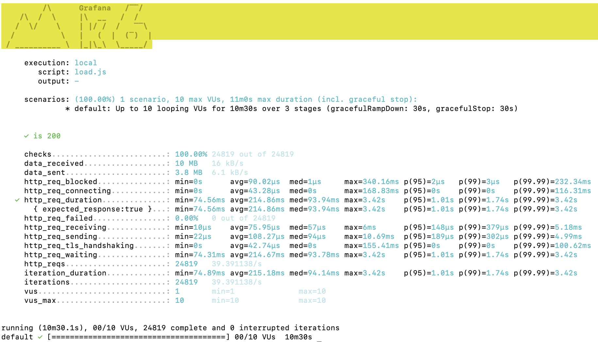
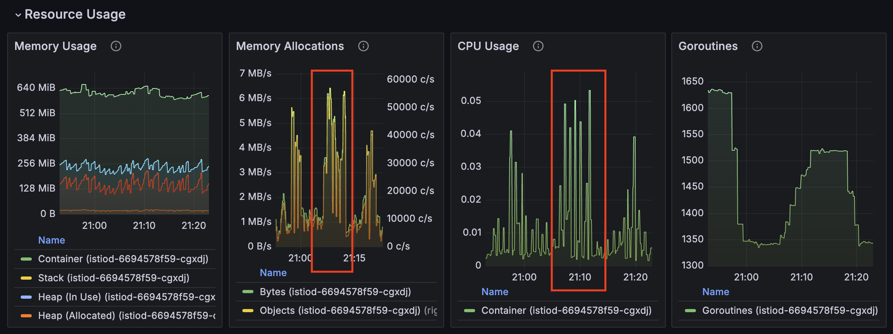

# **Full End-to-End ML Sentiment Analysis API**

This repository contains a collection of files and kustomization overlays for managing and deploying applications using Kustomization and Azure Kubernetes Services. The primary goal of this project is to set up a prediction endpoint using a pre-trained model from HuggingFace, which involves deploying a machine learning model to predict a positive or negative sentiment based on a text input. This lab focuses on setting up the API, building a Docker Image, and moving between development (using Minikube) and production (using Azure). 

# Directory Structure

The directory structure is organized as follows:

* `base`: This directory contains the base configuration for the application, including the `kustomization.yaml` file that defines the application's components, images, and other settings.
* `overlays`: This directory contains overlays that modify the base configuration for specific environments or scenarios. Each overlay directory contains its own `kustomization.yaml` file that inherits from the base configuration and applies additional settings or modifications.
* `patches`: This directory contains patches that can be applied to the base configuration or overlays to make specific changes. Patches are used to modify the configuration without changing the original files.

# Overlays

The following overlays are available:

* `dev`: This overlay is intended for development environments and applies settings specific to development, such as increased logging verbosity and relaxed security settings.
* `prod`: This overlay is intended for production environments and applies settings specific to production, such as optimized performance with istio-ingress and external requests.


# Dev Environment Setup and Shutdown Guide

This section explains how to set up, test, and shut down the development environment using Kubernetes and Minikube for the project.

---
---

## **Setting Up the Development Environment**

### **1. Start Minikube**
Start Minikube with the following command:
```bash
minikube start --kubernetes-version=v1.27.3
```

Verify that Minikube is running:
```
minikube status
```

### **2. Configure Docker to Use Minikube**

Point your Docker CLI to Minikube’s Docker environment:
```bash
eval $(minikube docker-env)
```

Verify by checking Docker’s configuration:
```bash
docker info | grep -i minikube
```

### **3. Build the Docker Image**

Build the application Docker image and tag it as mlapi:dev:
```bash
docker build -t mlapi:dev .
```

### **4. Apply Namespace**
Determine which context cluster and namespace are set to.
```bash
kubectl config current-context
```

Switch to minikube context.
```bash
kubectl config use-context minikube
```

Apply the namespace for the development environment:
```bash
kubectl apply -f k8s/overlays/dev/namespace.yaml
```

Verify that the namespace was created:
```bash
kubectl get namespaces
```

### **5. Deploy Resources**
Check kubectl context so that 
Use Kustomize to deploy the resources from k8s/overlays/dev:
```bash
kubectl apply -k k8s/overlays/dev
```

Verify that the pods and services are running:
```bash
kubectl get pods -n w255
kubectl get services -n w255
```

### **6. Expose the LoadBalancer**

Run Minikube tunnel in a separate terminal to expose the LoadBalancer:
```bash
minikube tunnel
```

### **7. Test the API**

Find the external IP and port for the mlapi-prediction-service:
```bash
kubectl get services -n w255
```

Use curl to test the API:
```bash
curl -X POST -H "Content-Type: application/json" -d '{"text": ["I love you", "I hate you"]}' http://127.0.0.1:<PORT>/project/bulk-predict
```

## **Shutting Down the Development Environment**

### **1. Delete Resources**

Remove all Kubernetes resources in the w255 namespace:
```bash
kubectl delete -k k8s/overlays/dev
```

### **2. Stop the Minikube Tunnel**

Find the minikube tunnel process and kill it:
```bash
ps aux | grep '[m]inikube tunnel'
kill -9 <PID>
```

### **3. Stop Minikube**

Stop the Minikube cluster:
```bash
minikube stop
```

### **4. Delete Minikube (Optional)**

If you want to completely clean up Minikube:
```bash
minikube delete
```

## **Troubleshooting**

1. **Pods Not Running:**
   - Check pod logs:
     ```bash
     kubectl logs <POD_NAME> -n w255
     ```

2. **Service Not Accessible:**
   - Verify the service:
     ```bash
     kubectl describe service mlapi-prediction-service -n w255
     ```


### Production Environment Setup

To deploy to a production environment, you will need to set up an Azure Kubernetes Service (AKS) account. Please follow the instructions provided by Microsoft to create an AKS cluster.

Once you have set up your AKS account, you will need to replace the `NAMESPACE` placeholder in the `overlays/prod/kustomization.yaml` file with the name of your AKS namespace.

4. Apply the generated configuration to your Kubernetes cluster using `kustomization apply`.


## Usage

To use this repository, follow these steps:

1. Clone the repository to your local machine.
2. Navigate to the directory containing the `kustomization.yaml` file for the environment you want to deploy to (e.g., `base`, `overlays/dev`, `overlays/prod`, etc.).
3. Install Azure CLI (sometimes referred to as az) on your local machine.
4. Install Azure Kubelogin on your machine.
5. Setup your Azure Account by running the following commands:
```
az login --tenant berkeleydatasciw255.onmicrosoft.com
```
```
az aks get-credentials --name w255-aks --resource-group w255 --overwrite-existing
```
switch back to original docker environment.
```
eval $(minikube docker-env -u)
```
6. Change your kubernetes context to the AKS cluster by running:
```
kubectl config use-context w255-aks
```
7. Login to ACR repository by running:
```
az acr login --name w255mids
```
8. Get your kubernetes namespace prefix, referred to as $NAMESPACE or $IMAGE_PREFIX, by running:
```
export NAMESPACE=alecarnassi
```
```
9. Push the customized image to ACR:
```
chmod +x push-to-acr.sh
./push-to-acr.sh
```
10. Apply the kustomization configuration for the production environment by running:
```
kubectl apply -k k8s/overlays/prod
```
11. Test the deployment by running:

```bash
curl -X POST -H "Content-Type: application/json" -d '{"text": ["I love you", "I hate you"]}' https://${NAMESPACE}.mids255.com/project/bulk-predict
```
and verify that the previous lab endpoint is also exposed (based on previous work):
```
curl -X 'POST' "https://${NAMESPACE}.mids255.com/lab/bulk-predict" -L -H 'Content-Type: application/json' -d '{"houses": [{ "MedInc": 8.3252, "HouseAge": 42, "AveRooms": 6.98, "AveBedrms": 1.02, "Population": 322, "AveOccup": 2.55, "Latitude": 37.88, "Longitude": -122.23 }]}'
```

## Kustomization

To customize the configuration for your specific use case, you can create your own overlays or modify the existing ones. You can also apply patches to make specific changes to the configuration without modifying the original files.

Remember to follow the Kustomization documentation and best practices for creating and managing overlays and patches.

## Docker Image Management

We are using two scripts to manage our Docker images:

* `push-to-acr.sh`: This script builds the Docker image on an Apple M1 architecture and pushes it to the ACR. Please adjust if using a different OS.


Please make sure to use the correct script for your architecture when managing Docker images.

## Grafana

### K6 Test
We utilize k6 to verify the efficiency of our API application. After 10:30 minutes, we can verify that our application performs with greater than 10 requests per second, specifically at 39.39 requests per second. Additionally, the 99th percentile of virtual users experience 1.74 s of latency, which is below the 2 s requirement. Please see the below test summary for more details.



### Istio Dashboards
Grafana dashboards also show some insights during the K6 testing, which takes place between 21:04 to 21:14 UTC. We highlight the associated resource usage as per the Istio dashboards:
- We can see a spike in memory allocation at a maximum around 6.4 MB/s
- CPU Usage also spiked during the k6 test to a maximum around 0.06

Both are slightly larger than the resource usage compared to the labs, which used a smaller, more simplistic model than the larger, finetuned distilbert model we use here. Yet, these metrics seem minimal given that we handle almost 40 requests per second and virtual users in the 99th percentile experience less than 2 seconds of latency which are both really promising results.

